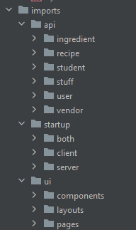

## Coding? More like KACHOW 
Similar to how a car has multiple components that come together to make a working vehicle, a design pattern works in the same way. Being able to build a car, you have the basics, its needs wheels, an engine, doors, etc. With this, there are multiple varieties of cars that exist out there that all have this same setup but look unique in their own rights.

For example, look at these two cars below. 

 

This is a perfect example of a design pattern because although they use the same key components, they fulfill two slightly different problems. One is built for speed, and the other is built for utility but are both still cars.

## Building the coolest ca... Websites!
Just like a car pattern, the websites that we've been building in class also follow a similar design pattern where we use meteor to develop different websites and it all comes down to a lot of the same components.

A lot of the files that we use are contained in the imports folder where api contains all of our collections that we would use to store information used on the website. In startup, we have publications which allow us to access the information in the collection. Another main component would be the UI where we design the different components and webpages to display all the information nicely in a clean looking website.

Just like what was mentioned above with the cars, the components used for the websites we developed in class for the most part the same which can be seen with the diversity of all the final projects in the class. We all need to create a functioning website with multiple features like different user roles, storing information, and being able to edit the information that is already stored on our websites. Even though we all have the same requirements, we can see that all of our websites are unique in their own way such as a food recipe website, study buddy websites, and even shopping websites that will all look different.
