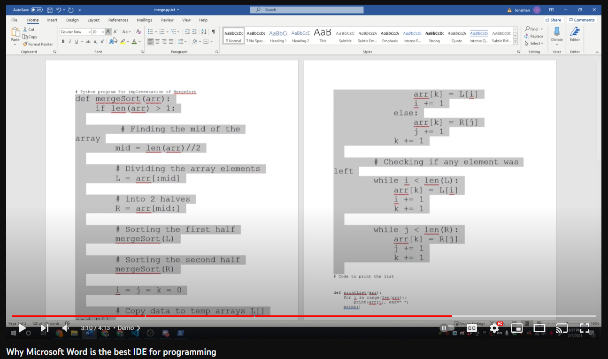

## History of my coding
Before this class, my idea of what software engineering was no where close to what it actually is. What I had originally thought about software engineering before this class was just from my EE160 and EE205 classes where we did C/C++ and would use it to solve problems like a temperature converter or a basic calculator. This along with seeing people complete LeetCode problems and just randomly coding with no structure (love me some spaghetti code), I thought software engineering was all about solving coding problems like the WODs that we would do in the beginning of the semester but this made me think about how creating some code to convert temperature would make me a software engineer. After this class, I learned that software engineering is way more than learning how to do technical problems.

## Learning to use the right tools
When it comes to anything in life, you want to make sure you are properly equipped for the job at hand. You wouldn't want to show up for an exam without a pencil or calculator and the same can be said with coding. You need to properly set yourself up for success and in the case of software engineering, I learned that part of it is setting up your development environment and proper coding standards to help you build your code faster. When working with a team of software engineers down the line, being able to use an IDE with ESlint and applying coding standards, this would help the whole team overall with organization and keeping the code consistent so that its easier to read and easier to manage through multiple iterations of the final project.

Talking about this reminds me of the Youtube video where someone uses Microsoft Word as their IDE which is painful to use as an IDE especially when working with others as there are no features, plugins, or shortcuts to help make everyone's life easier when working on the project.

Learning how to use Git and Github would've been nice to know when I was coding in my previous classes. Being able to create and upload code with others being able to collaborate on it with no hassle should've been something that was taught earlier but unfortunately it wasn't. My past classmates didn't know about Github either so we would upload our code into text files and upload them into Google Drive or directly copy and paste our code into an email and send it over. With GitHub, I can see how much productivity and organization is greatly increased when utilized correctly. It is overall just a great tool when it comes to working on code individually and as a group since it can track different changes made to the code, revert to different versions in the code's history, and being able to have multiple people work on different components while being able to merge all the components together seamlessly. I have no doubt in my mind that Github is a valuable tool not just in designing a web application for a group project but anything that requires me to code from now on.

Overall, this class has given me a lot of information and concepts that allow for my future success with software engineering as these lessons become more apparent as we gather more technical experience through our future internships and jobs.