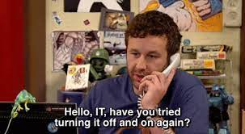

## How Did I Get Here?
Before I get into software engineering, I need to talk about how I got here. Growing up I always had a fascination with technology and always had to mess around with every new appliance my family would buy from Costco from fans, microwaves, and even TVs. Everything in my house was fair game when it came to me going around the house pressing every button to figure out what it did. This led me to become my household's personal "Geek Squad". I would be called to action everytime a phone call needed to be put on speaker, a VCR tape needed to be rewinded, an iPad needing to be connected to the wifi, and you guessed it, "fixing the internet" by turning the router on and off again. 

Before heading into college, I used my many years of experience to decide that working with computers would be great and without doing any extra research, I had to decide between Computer Science or Computer Engineering. I didn't know the difference and chose engineering because then my mom could brag to her relatives that I was studying engineering which in turn made me her favorite child (official title, obviously not self proclaimed). Now I am here, studying Computer Engineering and being caught in between Electrical Engineering and ICS.

## What's Next?
Throughout my undergraduate career, I have learned that I am very interested in renewable energy, sustainability, and after taking EE368, the internet of things as well. Especially since we live in Hawaii, I think being able to self sustain ourselves is important since we're so isolated from the rest of the world so it would be nice if we could at least produce our power in a sustainable way instead of relying on fossil fuels. 

 My past summer internship at Clearway Energy Group really helped open my eyes to the renewable energy industry here in Hawaii which motivates me even more to get my degree and apply my coding knowledge into any way possible to work in the industry. More information on my internship is on my projects page but it was really cool using python to filter over 10,000 lines of data to grab just the information I needed to determine the total potential revenue lost due to lost energy.

In order to prepare myself for a future career, I would want to become better at coding because I feel like my courses usually consists of a semester of coding, then a semester or not coding, and the cycle repeats itself. I don't want to just code to pass the class and do everything the night before. I want to improve upon my skills by consistently practicing so I don't lose that coding knowledge. Right now I am feeling motivated and am actually enjoying my current coursework consisting of ICS and engineering courses and I hope that I remain like this so I can really absorb and continue to enjoy the classes.
