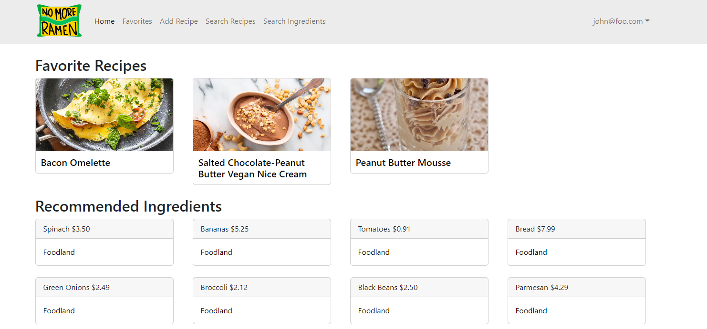
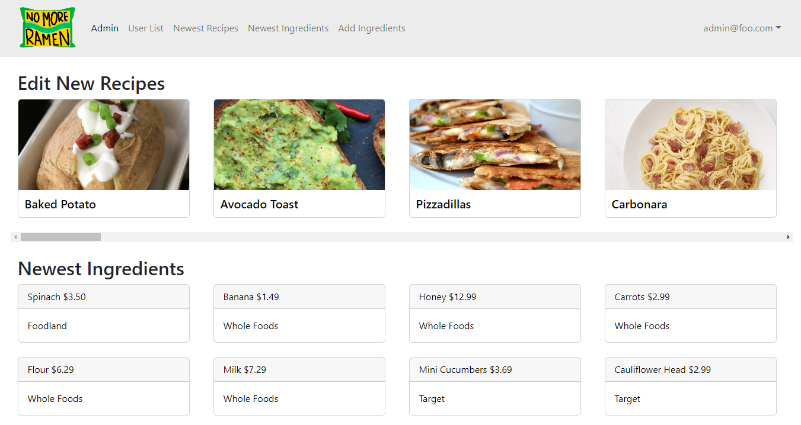

For the ICS314 Final Project, I worked with a group of four other students to create a web application called No More Ramen. This website was meant to be a place where students and vendors could go to not only search up recipes, but had loads of functionality such as uploading your own recipes, vendors being able to add ingredients to their online inventory so users could see locally available ingredients, being able to favorite recipes, and even putting filters to help find certain recipes too.

I was tasked to work on the student and admin home pages shown below.

These home pages serve as a way to easily navigate through the application by accessing specific recipes and ingredients based on the type of user role that is associated with the results. 

For the student or average user, the home page consists of their favorite recipes that they have discovered through the No More Ramen website and ingredients that vendors have available nearby. This allows them instant access to pull up their recipes and to see where the store locations are to purchase their ingredients.

As for the admins, their homepage will show the newest recipes and ingredients that have been uploaded to the website which will allow them lead them to the recipe and ingredient pages to validate them and make changes if necessary. Admins also have the option to be able delete any of these items as well.

For more information, you can also visit the project home page here: [No More Ramen Project Home Page](https://no-more-ramen.github.io/)
